# Nightly Triage

Разбор падений ночного прогона: от письма до классифицированной причины и заведённого
тикета.

**Базовый принцип: сначала исключить внешние причины, потом искать регрессию в коде.**
Ночь красная ≠ код сломан. Три механизма из Фазы 0 дают «регрессию за сутки» при
неизменном коде и стабильно съедают часы, если проверять их последними.

> Команды и имена джоб — под [проект-пример OrderShop](../../examples/example-project.md):
> GitLab CI, коллекции запросов, прогон через Newman. Список подстановок — в конце файла.
>
> Скрипты разбора, на которые ссылается этот скилл, лежат в
> [`tools/nightly`](../../tools/nightly/README.md).

## Что настроить один раз

Навык ходит в CI за артефактами. Без доступа он бесполезен, поэтому до первого запуска:

1. В `.envrc` (файл личный, в git не хранится):

   ```bash
   export GITLAB_URL=https://gitlab.example.com/api/v4   # именно с /api/v4
   export GITLAB_TOKEN=<personal access token>           # права: read_api
   export DEFAULT_PROJECT_ID=<namespace/project или id>
   ```

   После правки — `direnv allow`. В git worktree строку нужно продублировать: переменная
   должна быть в окружении до старта процесса.

   `DEFAULT_PROJECT_ID` принимается и числом, и путём `<группа>/<проект>`. Но **в URL путь
   обязан быть URL-кодированным**, иначе GitLab отвечает 404. Проверка доступа:

   ```bash
   source .envrc 2>/dev/null
   PROJECT=$(printf '%s' "${DEFAULT_PROJECT_ID}" | sed 's|/|%2F|g')
   curl -s "$GITLAB_URL/projects/$PROJECT" -H "PRIVATE-TOKEN: $GITLAB_TOKEN" | head -c 200
   ```

   Ответ — JSON проекта. `401` = токен, `404` = проект не тот либо слэш не закодирован.

2. Для MCP-сервера GitLab (если пользуешься им, а не только curl) зависимости не хранятся
   в git: `npm install --prefix tools/mcp-servers/mcp-gitlab`.

3. **direnv не доходит до оболочки агента** — в командах подгружать инлайн:
   `source .envrc 2>/dev/null`.

Ничего больше настраивать не нужно: воспроизведение работает на обычном локальном стенде.

## Запуск без номера пайплайна

Номер знать не обязательно. Последний ночной прогон — последний пайплайн нужного
расписания:

```bash
source .envrc 2>/dev/null
PROJECT=$(printf '%s' "${DEFAULT_PROJECT_ID}" | sed 's|/|%2F|g')
curl -s "$GITLAB_URL/projects/$PROJECT/pipeline_schedules/<SCHEDULE_ID>/pipelines?per_page=5&order_by=id&sort=desc" \
  -H "PRIVATE-TOKEN: $GITLAB_TOKEN" | jq -r '.[] | "\(.id) \(.status) \(.created_at)"'
```

Обычный `pipelines?source=schedule` не годится — в него попадают и другие расписания
(авто-мерж, E2E-прогоны), которые к ночным тестам отношения не имеют.

## Когда НЕ применять

- Падение одного теста в MR-пайплайне — обычный разбор, ночная специфика ни при чём.
- Локально красный `npm test` — это не ночная проблема.

---

## Фаза 0. Три внешние причины — проверять ПЕРВЫМИ

Проверяются **при любом числе упавших коллекций**, не только при массовом падении:
чужой код в образе даёт ровно точечную картину — падают те несколько коллекций, которых
касалась чужая ветка.

| Причина | Симптом | Как проверить |
| --- | --- | --- |
| **Данные загружаются ПОСЛЕ старта сервисов** — сервис кэширует идентификаторы при старте, загрузка данных их сносит | `Requested <тип>:<id> doesn't exist` (404 на update), `id of field X not found` / объект «archived/deleted» (409 на create). Падает пачкой, «вчера было зелено» | Сверить время джоб старта сервисов и загрузки данных; поискать эти строки в артефактах сбора логов |
| **В образе код ЧУЖОЙ ветки** — базовый образ не пересобирается, если уже существует | Ассерт противоречит целевой ветке: спецификация на ночном SHA даёт одно, API отвечает другое | Trace джобы сборки базового образа (несколько секунд + фраза про существующие образы) и длительность сборки; сравнить со временем MR-пайплайнов, отработавших перед ночью |
| **Фильтр набора коллекций задан в расписании** — переменная расписания перекрывает переменную job | Коллекция «не падает», потому что не запускалась; или запустилась та, что должна быть исключена | В trace джобы прогона первая строка со списком фактических фильтров |

Ни одна из трёх не чинится правкой теста или сервиса «по симптому».

## Фаза 1. Забрать артефакты (в trace деталей нет)

Джоба прогона гоняется с `--silent`, поэтому в логе видно только прогресс
`[N/M] start: <collection>`. **Все детали — в артефактах джобы.**

Что где лежит и как скачать через API — [references/artifacts.md](references/artifacts.md).

Коротко:

```
tests/run-reports/nightly-<PIPELINE_ID>/
├── last-run.json                       ← агрегат: кто упал и сколько
└── runs/<runId>/
    ├── summary/summary.{json,md,html}
    └── collections/
        ├── html/<collection>.html      ← дашборд по коллекции
        └── log/<collection>.log        ← построчный лог, отсюда временные окна
```

Логи сервисов — отдельная джоба сбора логов, артефакт `service-logs/*.log`.

## Фаза 2. Прочитать отчёт правильно

**Главная гочча:** статус коллекции — `assertions.failed`, **не** `requests.failed`.
`requests.failed: 0` значит лишь, что HTTP-ответ дошёл; 504 — тоже «успешный» запрос.

В дашборде смотреть плитку `Total Failed Tests` и вкладку `Failed Tests`;
`Total Assertions` — это всего ассертов, не упавших.

**Если кто-то уже назвал виновный MR** — сопоставь список упавших коллекций с доменом
этого MR прежде, чем что-то откатывать. Хотя бы одна упавшая коллекция из несвязанного
модуля означает, что гипотеза неполна: так выглядит общий эффект окружения, а не
регрессия одного домена.

**Первый упавший шаг важнее последних.** Типичная картина: один `POST` отклонён
валидацией → дальше десятки `GET` с `id=undefined`. Разбирать надо первый,
остальные — каскад.

Выжимка из отчёта одной командой:

```bash
node tools/nightly/extract-failures.js <report.json>
```

## Фаза 2.5. Фан-аут: коллекция = агент

Применять, когда **упало 3+ коллекций** и Фаза 0 не подтвердилась. Коллекции независимы:
у каждой свой лог, свой первый упавший шаг, своя причина. Последовательный разбор десятка
коллекций — это часы и переполненный контекст сырыми логами.

При 1–2 упавших коллекциях фан-аут не нужен — разбирай сам.

⚠️ Фан-аут запускается **по явной просьбе пользователя**, а не автоматически: десяток
агентов — заметный расход. Готовый скрипт — [`tools/nightly/triage-workflow.js`](../../tools/nightly/triage-workflow.js).

**Один агент = одна коллекция.** Модель `sonnet`. Агент работает **только на чтение**:
он возвращает разбор, а не правки, и в промпте это повторяется явно.

Что даётся агенту на вход:

- путь к `collections/log/<collection>.log` и к дашборду коллекции;
- путь к `service-logs/*.log` за то же временное окно;
- напоминание, что статус берётся из `assertions.failed`, а не `requests.failed`;
- таблица классификации и деление на Класс A / Класс B из Фазы 3.

Формат ответа агента — строго такой, иначе сводная таблица не соберётся:

```
Коллекция:        <имя>
Первый упавший:   <метод> <путь> — шаг «<имя шага>»
Ожидалось:        <что ждал тест>
Получено:         <что вернул сервис, с кодом ответа>
Категория:        TEST_BUG | BACKEND_BUG | SEED_DATA | ENVIRONMENT
Класс:            A (валидация и каскад) | B (деградация под нагрузкой) | —
Доказательство:   <file:line в коде сервиса или в коллекции>
Каскад:           <сколько последующих падений объясняется этим шагом>
Уверенность:      высокая | средняя | низкая — и чего не хватило
```

Чего агент **не** делает: не правит коллекции и код, не предлагает менять API или
ослаблять ассерт, не заводит тикеты.

Дальше основной поток сводит ответы в таблицу и проверяет два признака, которые видны
только на всей картине:

- одна и та же категория у коллекций из **несвязанных модулей** — значит причина общая
  (окружение или данные), и разбирать надо её, а не каждую коллекцию по отдельности;
- у нескольких агентов «уверенность: низкая» на одном и том же месте — признак, что
  не хватает артефакта, а не анализа.

## Фаза 3. Классифицировать причину

Обязательная классификация — та же, что у
[`troubleshooter`](../../agents/roles/troubleshooter.md): `TEST_BUG` / `BACKEND_BUG` /
`SEED_DATA` / `ENVIRONMENT`.

Дополнительно различать два класса ночных падений:

- **Класс A — валидация и каскад.** Create-операция отклонена (400/422/403), дальше
  цепочка 404/400 на зависимых шагах. Причины: поле переименовано или не соответствует
  контракту, нарушен формат (`maxLength`, тип), нарушена уникальность, не выдано право,
  недетерминированный порядок элементов из базы (тест берёт `[0]` из неотсортированной
  выборки).
- **Класс B — деградация под нагрузкой.** 504/503/500 на тяжёлых и экспортных запросах
  ближе к концу прогона, время ответа выше порога. Коллекции гоняются последовательно
  против единого окружения, данные загружаются один раз в начале, изоляции между
  коллекциями нет.

**Отдельный паттерн backend-багов:** сервис подмешивает служебное поле в create-payload →
требуется несуществующее право `{entity}.{field}.create` → 403/400 для всех.

```dot
digraph triage {
  rankdir=LR;
  "Фаза 0:\nтри внешние причины" [shape=box];
  "Подтвердилась?" [shape=diamond];
  "Причина найдена:\nчинить механизм, не тест" [shape=box];
  "Первый упавший шаг\nв коллекции" [shape=box];
  "Ответ 5xx / долгий?" [shape=diamond];
  "Класс B: нагрузка\n(ENVIRONMENT)" [shape=box];
  "Сверить payload и ответ\nс контрактом API" [shape=box];
  "Контракт нарушает\nтест или сервис?" [shape=diamond];
  "TEST_BUG:\nчинить коллекцию" [shape=box];
  "BACKEND_BUG:\nзавести тикет" [shape=box];

  "Фаза 0:\nтри внешние причины" -> "Подтвердилась?";
  "Подтвердилась?" -> "Причина найдена:\nчинить механизм, не тест" [label="да"];
  "Подтвердилась?" -> "Первый упавший шаг\nв коллекции" [label="нет"];
  "Первый упавший шаг\nв коллекции" -> "Ответ 5xx / долгий?";
  "Ответ 5xx / долгий?" -> "Класс B: нагрузка\n(ENVIRONMENT)" [label="да"];
  "Ответ 5xx / долгий?" -> "Сверить payload и ответ\nс контрактом API" [label="нет"];
  "Сверить payload и ответ\nс контрактом API" -> "Контракт нарушает\nтест или сервис?";
  "Контракт нарушает\nтест или сервис?" -> "TEST_BUG:\nчинить коллекцию" [label="тест"];
  "Контракт нарушает\nтест или сервис?" -> "BACKEND_BUG:\nзавести тикет" [label="сервис"];
}
```



Разбор Класса B отдельной методикой — [`tools/nightly/README.md`](../../tools/nightly/README.md),
раздел «Класс B: зависания под нагрузкой».

## Фаза 4. Воспроизвести

Разница «ночь vs локально» — в **раннере**, а не в стеке. Тот же раннер против локального
стенда воспроизводит большинство падений без docker-сборки:

```bash
node tests/run-collections.js \
  --env tests/environment/local-dev.json \
  --filter <substring> --log-formats json --retries 0
```

Подробности, включая генерируемые фикстуры и ловушки повторных прогонов, —
[references/local-repro.md](references/local-repro.md).

Полный docker-стек нужен **только** для инфра-специфики (файловое хранилище, порядок
джоб, поведение образов) — [references/nightly-stack.md](references/nightly-stack.md).

## Фаза 5. Закрыть

- `TEST_BUG` → чинить коллекцию, прогнать её же раннером до 0 падений.
- `BACKEND_BUG` → отдельный тикет с первым упавшим запросом, ответом и ссылкой на
  pipeline. Не чинить в рамках разбора ночи, если фикс выходит за пределы теста.
- `ENVIRONMENT` (Класс B) → зафиксировать замеры из `service-logs`, не «чинить»
  повышением порога без разбора, куда ушло время.
- `SEED_DATA` → правка загрузчика данных, проверка полной перезагрузкой.

**Если требуют зелёную ночь к сроку, а разбор не укладывается:** порог в тесте не
поднимать и ассерт не ослаблять — так падение исчезает навсегда вместе со способностью
его поймать. Допустимый временный обход — отключить коллекцию (`*.disabled.json`)
с заведённым тикетом и явным решением человека, а не молча.

**Изменять API или контракт ради прохождения теста запрещено.**

## Red flags — остановись

- «Тест перестал падать» вместо объяснённого механизма: что именно, в какой строке,
  при каком условии даёт наблюдаемый эффект.
- Разбор начат с последнего упавшего ассерта, а не с первого.
- Вывод сделан по `requests.failed` вместо `assertions.failed`.
- Гипотеза взята из письма или тикета и не сверена с кодом.
- Порог времени или ассерт ослаблены, чтобы «ночь позеленела», без объяснения, куда
  ушло время.
- Локальный 504 при нехватке памяти засчитан как воспроизведение ночной нагрузки —
  локальная машина слабее CI-раннера, это не одно и то же.
- Фикс предложен до того, как проверены три внешние причины из Фазы 0.

## Прецеденты

Реальные разборы с исходного проекта — форма важнее деталей:

- **Массовое падение 30 коллекций из 158** оказалось не регрессией: 13 чинились как
  тесты (поля не по контракту, даты вне рабочего графика, недетерминированный `[0]`
  из базы), 5 отделены в backend-баги, остальное — нагрузка и загрязнение общего
  окружения.
- **4 коллекции упали на типе поля**, хотя целевая ветка давала другой тип: ночь
  поднялась на образе, перезаписанном MR-пайплайном чужой ветки за час до старта.
- **30 падений в двух коллекциях** после ночи без изменений кода: сервисы стартовали
  до загрузки данных и держали идентификаторы прошлой ночи.

Общее у всех трёх: причина была вне кода, а первая гипотеза указывала на код.

---

## Точки подстановки

| Что | Сейчас (OrderShop) | Чем заменить |
| --- | --- | --- |
| CI | GitLab, `GITLAB_URL` / `GITLAB_TOKEN` | Своей CI-системой и её API |
| `<SCHEDULE_ID>` | плейсхолдер | Id своего ночного расписания |
| Имена джоб | `nightly:*` | Своими; порядок важнее имён |
| Раннер коллекций | `tests/run-collections.js` | Своим прогонщиком |
| Раскладка артефактов | `tests/run-reports/nightly-<id>/` | Своей |
| Классификация | 4 категории | Оставить как есть |
| Три внешние причины | загрузка данных после старта, чужой образ, фильтр из расписания | Своими — но эти три встречаются почти в любом ночном пайплайне |

**Чего в этом скилле намеренно нет.** Команд подъёма ночного стека конкретного проекта:
они состояли из имён его джоб, портов и переменных окружения. Вместо них —
[references/nightly-stack.md](references/nightly-stack.md): чек-лист того, что должно
быть в твоём ночном стеке и в каком порядке, без команд.
