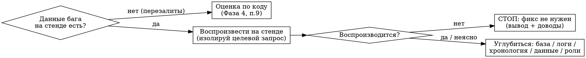

# Review Bug

## Overview

Ревью бага — это проверка **причины**, а не текста описания. Ключевой принцип:

> **Не верь описанию бага на слово. Проверяй причину, а не симптом. Воспроизводи
> на актуальном коде, прежде чем оценивать фикс.**

Баг может оказаться лагом деплоя (фикс уже влит, но не задеплоен), особенностью тестовых
данных, неверной ожидаемой моделью или уже исправленным в смежной задаче. Фикс может
лечить симптом или обходить архитектуру — например, выполнять операцию от системного
пользователя мимо ролевой модели. Цель — отделить «фикс нужен и корректен» от «фикс
не нужен или лечит не то».

Связанные скиллы: [`read-bug`](../read-bug/SKILL.md) (описание из трекера),
[`get-comment`](../get-comment/SKILL.md) (ремарки из MR).
Что должно быть доступно на стенде — раздел [«Требования к стенду»](#требования-к-стенду).

> Конкретика — [проект-пример OrderShop](../../examples/example-project.md).

## When to Use

- Просят отревьюить баг и есть MR с фиксом.
- Есть сомнение «а нужен ли фикс» или «лечит ли он причину».
- Баг переоткрыт после предыдущего исправления.
- Нужно понять, почему фикс не сработал.

**Не для:** обычного ревью фичи без бага (используй критическое ревью напрямую);
чистого ответа на ремарки MR без анализа бага (используй
[`resolve-remarks`](../resolve-remarks/SKILL.md)).

---

## Процедура (эскалация от дешёвого к дорогому)

Не трать тяжёлые ресурсы — полный критический разбор, прогоны на стенде — без причины.
Сначала дёшево: гипотеза и go/no-go. Потом дорого.

### Фаза 1 — Контекст

1. `/read-bug <id>` → описание, скриншоты, комментарии. Извлечь: **ожидаемый результат**,
   шаги воспроизведения, настройки (роли, признаки сущностей, кто создавал данные).
2. Получить `source_branch` MR, сделать `git fetch` и `checkout` ветки.

### Фаза 2 — Быстрое ревью (дёшево)

3. Прочитать diff (`git diff origin/<BASE_BRANCH>...HEAD`). Понять, **что** меняет фикс
   и **как** это соотносится с описанием.
4. Сформировать **гипотезу причины** бага и красные флаги фикса: обход прав или
   архитектуры, мёртвый код, превращение fail-fast в fail-soft, «лечит симптом,
   а не причину». Углубляться пока не надо — отметить и идти проверять причину.

### Фаза 3 — Проверка причины

Развилка: воспроизводится ли баг на **актуальном** коде стенда?



5. **Воспроизвести (go/no-go).**

   - **5a. СНАЧАЛА проверь, есть ли данные бага на стенде** — сущности из описания,
     прямым запросом к базе. Общий стенд периодически перезаливают, и данные, созданные
     репортёром вручную, могли быть **стёрты**. Нет данных → точное воспроизведение
     невозможно, переходи к Фазе 4, ветка «причину доказать нельзя».
   - **5b.** Запусти релевантную существующую коллекцию по фиче против стенда. Минимально
     и точечно — **не** весь набор. Готовой нет — собери минимальную.
     **Стенд = целевая ветка без этого MR.**
   - **5c. Сравниваешь поведение под разными ролями?** Изолируй **целевой** запрос
     фиксированным URL: одинаковые параметры под обоими пользователями. **Не доверяй**
     сводному pass/fail коллекции: её подготовительные запросы сами зависят от роли
     (добывают идентификаторы по имени) и под другим пользователем дают другие или
     пустые параметры → **ложное** «воспроизведение». Падение теста ≠ воспроизведение
     бага, пока запрос не изолирован.
   - **Не воспроизводится** при наличии данных → фикс, скорее всего, не нужен. Стоп.
   - **Воспроизводится или неясно** → углубляйся (шаг 6).

6. **Углубиться** (только при необходимости), от дешёвого к дорогому:

   - **Хронология и лаг деплоя:** сравнить дату деплоя стенда с датой влития фикса
     (`git show -s --format=%ci <commit>`). Баг мог быть заведён до того, как фикс доехал.
   - **Тестовые данные:** проверить, не залита ли сущность загрузчиком данных
     (признак — служебный автор создания, хардкод в файлах модели). Такие данные минуют
     бизнес-логику, и выводы по ним неверны.
   - **База:** данные конкретных сущностей. ⚠️ Их может уже не быть после перезалива —
     тогда смотри логи и воспроизведение, а не данные.
   - **Логи сервисов** на стенде: трейс входа и выхода, ошибки. Строка завершения
     операции показывает, какие поля реально вернулись — это права на уровне поля вживую.
   - **Роли и права:** если гипотеза про права — проверить, есть ли у роли-создателя
     нужное право на чтение поля.
   - **Задеплоенный код:** найти маркер фикса внутри контейнера, чтобы подтвердить,
     что стенд действительно **без** MR.

### Фаза 4 — Развилка по обоснованности

7. **Фикс не обоснован** — не воспроизводится при наличии данных, лечит симптом или
   обходит архитектуру → полное **критическое ревью** и вердикт «не вливать» с доводами.
   Стоп.
8. **Фикс обоснован** → полное критическое ревью + `/get-comment`: ремарки авторевью —
   проверить, **обоснованы** ли они (критически, с учётом кода) и **применены** ли в коде.
9. **Причину доказать нельзя** — данных бага нет, стенд без фикса, на тестовых данных
   не воспроизводится → **не выдавай** «фикс верный» за доказанное. Оцени фикс **по коду**:
   адресует ли он правдоподобный механизм правильным способом (штатные механизмы против
   обхода архитектуры). Вывод формулируй честно: «фикс адресует вероятную причину, но
   **требует подтверждения** — автору воспроизвести под конкретным пользователем
   и данными».

   **9a. Проверить сам фикс — чинит он или ломает — можно только с кодом фикса.**
   Стенд = целевая ветка **без** MR, он показывает поведение ТОЛЬКО без фикса. Если из
   кода виден риск (правка меняет выборку, права или проекцию в зависимости от роли),
   **подними ветку фикса локально** — именно ветку MR, не целевую ветку — и прогони
   **тот же запрос** с фиксом против стенда без фикса. Это **единственный** способ
   поймать регрессию.

   Реальный пример: фикс добавил в выборку условие по служебному признаку — и у
   пользователя без доступа к смежной сущности поле «ответственный» опустело.
   Аналитика такую регрессию только предполагает, прогон — доказывает.

   Учти: тестовые данные локально совпадают со стендом (один и тот же загрузчик), но
   **идентификаторы другие** — добывай их заново, а не копируй из стенда.

**Ранжирование ремарок** — применять к обоим источникам, и к своим находкам, и к
комментариям MR: очевидные (исправить) / спорные (обсудить) / отклонить (с обоснованием).

**При расхождении источников** (авторевью против агента против твоего чтения) доверяй
**фактической проверке кода** — grep, чтение схемы, поиск использований — а не сводке.
Ошибаются и авторевью, и агент: типичные ошибки — «мёртвый код», который на самом деле
вызывается, и поле, «отсутствующее» в схеме, которое там есть.

### Фаза 5 — Завершение

10. **Cleanup стенда** — обязательно, если создавал данные: собрать идентификаторы
    созданных сущностей и удалить их, дети раньше родителей. Прогоны только на чтение
    чистить не надо.
11. Итоговый вывод: вердикт, доводы, статус ремарок.

---

## Критическое ревью (промпт)

Запускать в Фазе 4, когда есть смысл придираться к деталям:

```
You are an experienced software engineer performing a code review.
Analyze the latest commits done in this session and provide a thorough review.

Focus on:
- Bugs and potential issues
- Security concerns
- Code quality and readability
- Performance issues
- Suggestions for improvement

Format your review in markdown. Be constructive and specific.
Reference file names and line changes where relevant.

IMPORTANT: Write the entire review in Russian.
```

---

## Требования к стенду

Скилл не привязан к конкретному стенду, но без четырёх возможностей ниже половина
процедуры не выполняется. Проверь, что у тебя есть доступ, и запиши команды под свой
стенд рядом с этим файлом.

| Возможность | Зачем в процедуре | Достаточно |
| --- | --- | --- |
| **Логин по API и выполнение запроса от имени роли** | Шаг 5b, 5c: изолированный целевой запрос под разными пользователями | HTTP-клиент и учётные данные тестовых пользователей |
| **Прямой запрос к базе** | Шаг 5a: есть ли вообще данные бага; шаг 6: права роли, признаки загрузчика | Клиент базы либо HTTP-эндпоинт запросов |
| **Прогон коллекции против стенда** | Шаг 5b: воспроизведение существующим тестом | Прогонщик коллекций с указанием окружения |
| **Чтение логов сервисов** | Шаг 6: какие поля реально вернулись, ошибки | Доступ к логам контейнеров |

Плюс два условия, без которых выводы будут неверными:

- **Стенд должен быть на целевой ветке без проверяемого MR.** Если это не так,
  «не воспроизводится» ничего не означает — фикс уже внутри.
- **Известна дата последнего деплоя и последнего перезалива данных.** Обе нужны
  на шаге 6; без них лаг деплоя и стёртые данные неотличимы от «бага нет».

---

## Common Mistakes

- **Поверить описанию бага и сразу ревьюить код.** Сначала воспроизведи причину.
- **Полный критический разбор до go/no-go.** Зря потраченные ресурсы, если фикс не нужен.
- **Прогон всех интеграционных тестов.** Долго и не обосновано — бери точечную коллекцию.
- **Доверять данным по сущности из бага.** Её может уже не быть после перезалива;
  и она могла быть залита загрузчиком, минуя бизнес-логику.
- **Забыть cleanup стенда** после создания тестовых данных.
- **Принять «улучшение», обходящее архитектуру, за необходимый фикс.** Операция от
  системного пользователя мимо прав чинит симптом и создаёт дыру — это разные вещи.
- **Поверить падению коллекции при сравнении ролей.** Подготовительные запросы под другим
  пользователем дают пустые параметры → ложное «воспроизведение». Изолируй целевой запрос
  фиксированным URL.
- **Выдать «фикс верный» за доказанное, когда причину воспроизвести нельзя.** Честная
  формулировка: «требует подтверждения автором».
- **Принять сводку авторевью или агента на веру.** Проверяй код фактически.
- **Оценить фикс только аналитически, когда есть сомнение в регрессии.** Стенд без фикса
  её не покажет: подними ветку фикса локально и прогони тот же запрос.

---

## Точки подстановки

| Что | Сейчас | Чем заменить |
| --- | --- | --- |
| `<BASE_BRANCH>` | целевая ветка MR | Своей (`main`, `develop`) |
| Общий стенд | абстрактный | Своим; команды доступа — в «Требованиях к стенду» |
| Прогонщик коллекций | абстрактный | Своим инструментом интеграционных тестов |
| Трекер и хостинг MR | OpenProject + GitLab | Своими — через `/read-bug` и `/get-comment` |

**Чего в этом скилле намеренно нет.** В исходной версии рядом лежал файл на 172 строки
с готовыми рецептами для конкретного стенда: как залогиниться, какие запросы к базе дают
нужные данные, как прогнать коллекцию, как почистить за собой. Он не переносится — это
были команды одного окружения. Вместо него — таблица «Требования к стенду»: что должно
быть доступно и на каком шаге это нужно. Свои команды впиши туда один раз, и скилл
станет рабочим.
